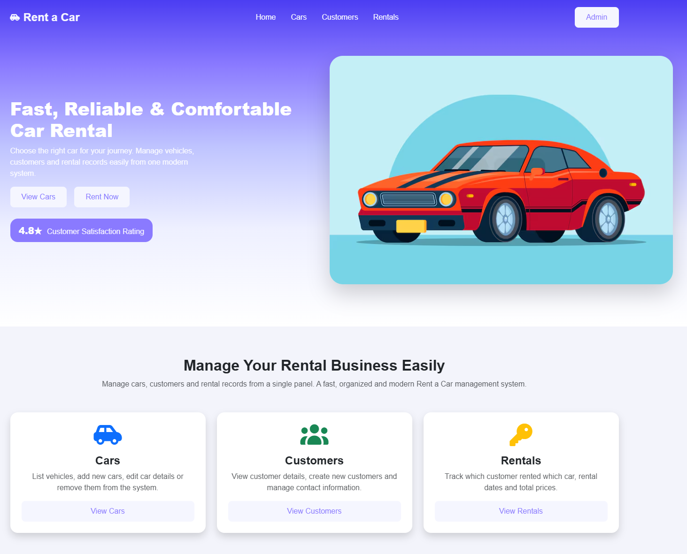
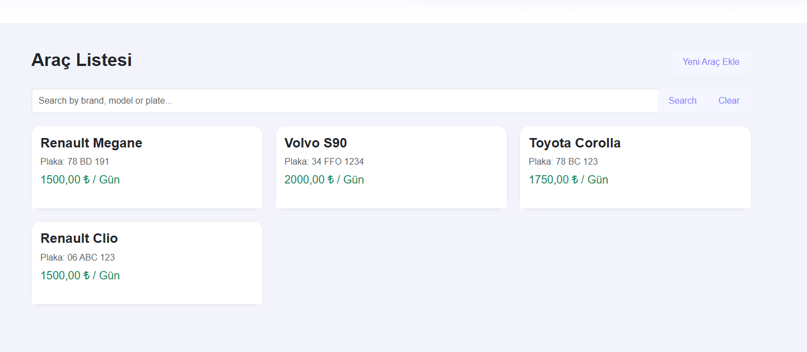
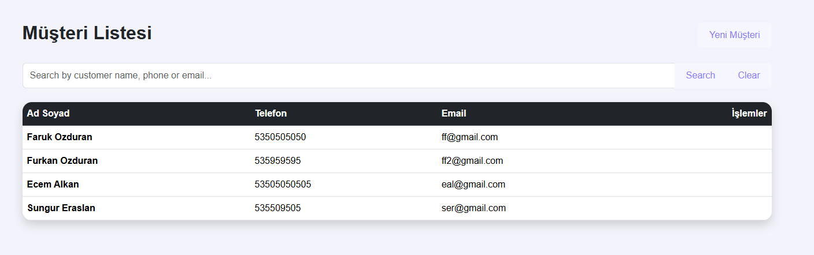
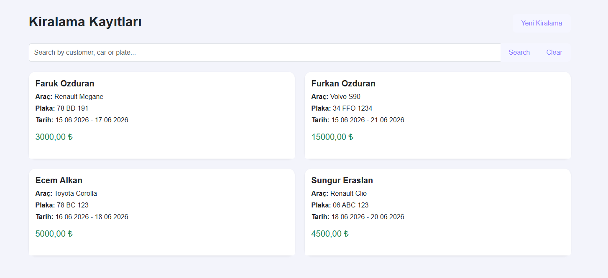
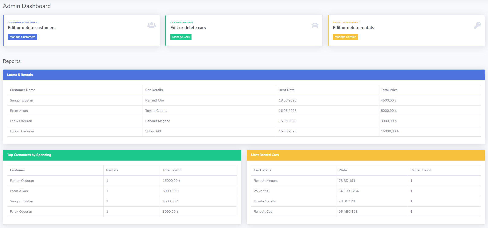
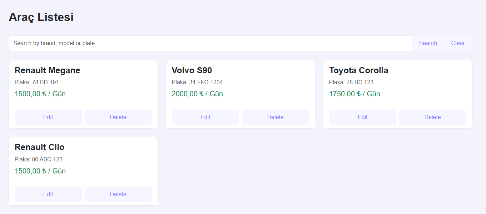
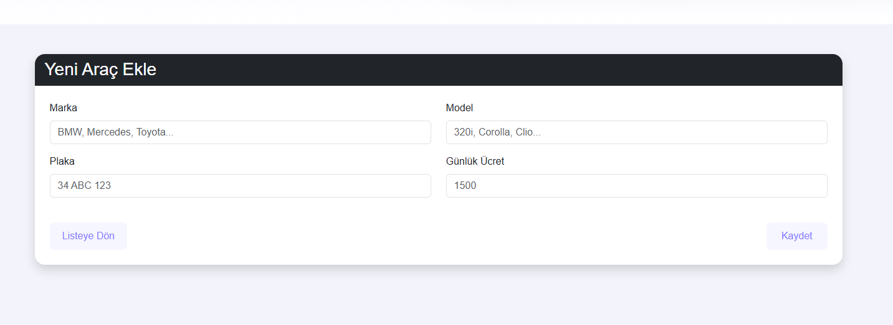

# Rent App

Rent App, araç, emlak veya ekipman kiralama süreçlerini yönetmek için tasarlanmış modern bir web uygulamasıdır. Bu proje, **ASP.NET Core MVC** mimarisi kullanılarak geliştirilmiş olup, veritabanı işlemleri için **Entity Framework Core** ve **SQL Server** altyapısını kullanmaktadır.

## 🚀 Teknolojiler ve Altyapı

Bu projede aşağıdaki teknolojiler ve kütüphaneler kullanılmıştır:

*   **.NET 10.0**
*   **ASP.NET Core MVC** (Model-View-Controller mimarisi)
*   **Entity Framework Core 10.0.9** (ORM - Object Relational Mapping)
*   **SQL Server** (Veritabanı Yönetim Sistemi)

## 📁 Proje Yapısı

Proje temel MVC (Model-View-Controller) mimarisine uygun olarak yapılandırılmıştır:

*   **`Controllers/`**: Gelen HTTP isteklerini işleyen ve model ile view arasındaki bağlantıyı kuran kontrolcü sınıfları.
*   **`Models/`**: Veritabanı tablolarını temsil eden entity (varlık) sınıfları ve iş mantığı kuralları. (`AppDbContext` yapılandırmasını içerir)
*   **`Views/`**: Kullanıcıya sunulan HTML arayüz dosyaları (.cshtml).
*   **`wwwroot/`**: CSS, JavaScript, görseller gibi statik web dosyaları.
*   **`appsettings.json`**: Veritabanı bağlantı dizesi (Connection String) ve diğer uygulama ayarları.
*   **`Program.cs`**: Uygulamanın başlangıç noktası, servislerin ve middleware (ara katman) yapılandırmalarının yapıldığı dosya.

## 🛠️ Kurulum ve Çalıştırma

Projeyi yerel ortamınızda çalıştırmak için aşağıdaki adımları izleyin:

### Ön Koşullar

*   [.NET 10.0 SDK](https://dotnet.microsoft.com/download/dotnet/10.0) sisteminizde yüklü olmalıdır.
*   Yerel veya uzak bir **SQL Server** veritabanına erişiminiz olmalıdır.

### Adımlar

1.  **Projeyi Klonlayın veya İndirin:**
    ```bash
    git clone <repository-url>
    cd Rent-App
    ```

2.  **Veritabanı Bağlantısını Ayarlayın:**
    `appsettings.json` veya `appsettings.Development.json` dosyasını açın ve `DefaultConnection` altındaki bağlantı dizesini (Connection String) kendi SQL Server bilgilerinize göre güncelleyin.
    ```json
    "ConnectionStrings": {
      "DefaultConnection": "Server=YOUR_SERVER_NAME;Database=RentAppDb;Trusted_Connection=True;MultipleActiveResultSets=true;TrustServerCertificate=True;"
    }
    ```

3.  **Entity Framework Migrations (Veritabanını Oluşturma):**
    Terminal (veya Package Manager Console) üzerinden projenin bulunduğu dizinde aşağıdaki komutu çalıştırarak veritabanını ve tabloları oluşturun:
    ```bash
    dotnet ef database update
    ```
    *(Not: Eğer `dotnet ef` aracı yüklü değilse `dotnet tool install --global dotnet-ef` komutuyla yükleyebilirsiniz.)*

4.  **Uygulamayı Çalıştırın:**
    Projeyi başlatmak için aşağıdaki komutu kullanın:
    ```bash
    dotnet run
    ```
    Uygulama başarıyla derlendikten sonra terminalde belirtilen `http://localhost:<port>` veya `https://localhost:<port>` adresi üzerinden tarayıcınızda görüntüleyebilirsiniz.


    ## 📸 Ekran Görüntüleri (Screenshots)

Araç ve kiralama yönetim sisteminin kullanıcı arayüzüne ve yönetim paneline ait ekran görüntülerine aşağıdan ulaşabilirsiniz:

### 🌐 Ana Sayfa (Genel Bakış)


---

### 📋 Listeleme ve Kayıt Ekranları
Sistemde yer alan araçların, kayıtlı müşterilerin ve kiralama işlemlerinin görüntülendiği listeleme ekranları:

<table width="100%">
  <tr>
    <td width="33%" align="center">
      <strong>Araçlar (Cars)</strong><br />
      
    </td>
    <td width="33%" align="center">
      <strong>Müşteriler (Customers)</strong><br />
      
    </td>
    <td width="33%" align="center">
      <strong>Kiralamalar (Rentals)</strong><br />
      
    </td>
  </tr>
</table>

---

### ⚙️ Yönetim Paneli (Admin Area)
Sistem yöneticilerinin metrikleri takip ettiği ve yeni araç kayıtlarını gerçekleştirdiği yönetim arayüzleri:

<table width="100%">
  <tr>
    <td width="33%" align="center">
      <strong>Admin Dashboard</strong><br />
      
    </td>
    <td width="33%" align="center">
      <strong>Araç Yönetimi (Admin Cars)</strong><br />
      
    </td>
    <td width="33%" align="center">
      <strong>Yeni Araç Ekle (Create Car)</strong><br />
      
    </td>
  </tr>
</table>
